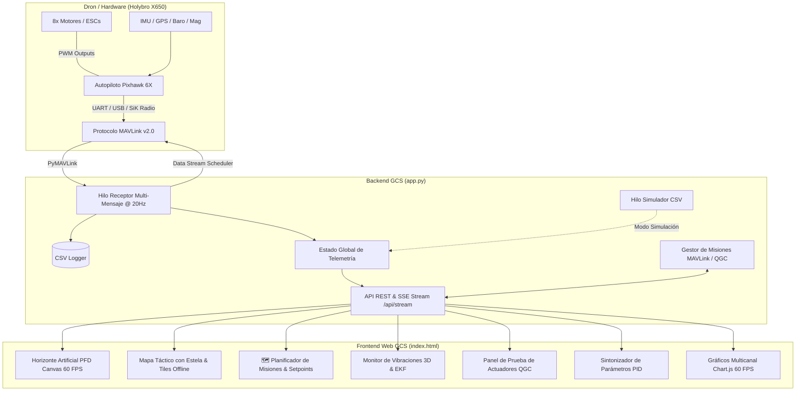

# Estación Terrena de Telemetría & Control - Holybro X650 (Pixhawk 6X)

[](https://www.python.org/)
[](https://flask.palletsprojects.com/)
[](https://mavlink.io/)
[](https://holybro.com/products/pixhawk-6x)
[](https://holybro.com/)
[](LICENSE)
[-red.svg)](https://www.ubo.cl/)

---

## Descripción General

Este repositorio contiene la **Estación Terrena de Control (GCS - Ground Control Station)** de alto rendimiento desarrollada para la plataforma aérea no tripulada **Holybro X650** equipada con el autopiloto **Holybro Pixhawk 6X** (compatible con stacks **PX4 Autopilot** y **ArduPilot**).

Diseñada para entornos de **investigación, desarrollo, pruebas de banco y planificación táctica de vuelo**, la estación ofrece adquisición de telemetría a **20 Hz**, instrumentos de vuelo aeronáuticos primarios (PFD) en Canvas a 60 FPS, planificador interactivo de misiones por **Setpoints/Waypoints compatible con QGroundControl**, selección dinámica de puertos COM con Web Serial API, análisis de vibraciones 3D, salud del estimador EKF, sintonización de parámetros PID en caliente y un modo simulador con reproducción de logs CSV.

---

## Arquitectura del Sistema



---

## Características Principales

### 1. Planificador de Rutas & Setpoints (QGroundControl Style)
- **Trazado Interactivo en Mapa**: Clics sobre el mapa para colocar setpoints numerados (`WP1`, `WP2`, `WP3`...), marcadores arrastables y polilínea de vuelo.
- **Edición de Parámetros de Ruta**: Configuración de altitud (m), velocidad crucero (m/s) y comandos (`TAKEOFF`, `WAYPOINT`, `LOITER`, `RTL`, `LAND`).
- **Métricas Tácticas**: Cálculo en vivo de la **Distancia Total del Plan de Vuelo (m/km)** y **Tiempo Estimado de Vuelo**.
- **Protocolo MAVLink de Misión**: Transmisión bidireccional de waypoints al Pixhawk (`MISSION_CLEAR_ALL` + `MISSION_COUNT` + `MISSION_ITEM_INT`) y activación en modo `AUTO`.
- **Compatibilidad QGroundControl**: Exportación e importación directa de archivos `.plan` oficiales de QGroundControl.

### 2. Primary Flight Display (PFD) Aeronáutico
- Renderizado fluido en **HTML5 Canvas a 60 FPS**.
- Escala de cabeceo (*Pitch Ladder* -80° a +80°) y arco de alabeo (*Roll Arc*).
- Cinta superior de rumbo magnético (*Heading Tape*).
- Cintas laterales de velocidad (m/s y km/h) y altitud (AGL) con indicador de velocidad vertical (*VSI*).

### 3. Conectividad Dinámica & Web Serial API
- Selección libre e ingreso manual de puertos COM (`COM1` a `COM256`, `/dev/ttyUSB0`, UDP/TCP).
- **Web Serial API**: Detección nativa del dispositivo USB/Serie directamente mediante el navegador.
- Escaneo automático de puertos seriales y módems de radio SiK.
- Servidor SSE (*Server-Sent Events*) para transmisión de telemetría a 20 Hz sin sobrecarga de sondeo HTTP.

### 4. Gráficos Multicanal Sin Recorte (Chart.js 60 FPS)
- Selector de ventanas temporales ajustables (10s, 30s, 60s, 120s, 300s o **Historial Completo sin corte**).
- Desduplicación inteligente entre SSE y Polling.
- Actualizaciones a 60 FPS sin colisiones de animación ni descarte prematuro de datos.

### 5. Diagnóstico de Sensores, Vibraciones 3D & EKF
- Monitor de vibraciones triaxial ($Vibe_X, Vibe_Y, Vibe_Z$) con indicadores de seguridad y detección de clipping.
- Monitoreo de varianzas del filtro EKF (velocidad, posición horizontal/vertical, brújula).
- Diagnóstico de batería con cálculo de voltaje por celda (3S/4S/6S), corriente y consumo en mAh.

### 6. Banco de Pruebas de Actuadores (QGC Style)
- Prueba independiente para hasta 8 motores mediante `MAV_CMD_ACTUATOR_TEST` (PX4) y `MAV_CMD_DO_MOTOR_TEST` (ArduPilot).
- Interruptor de seguridad maestro, deslizador maestro y parada de emergencia instantánea (Tecla `Espacio`).

### 7. Sintonizador de Ganancias PID
- Ajuste rápido de ganancias P, I, D de Roll Rate, Pitch Rate, Yaw Rate y límites de velocidad (`MPC_XY_VEL_MAX`, etc.) con guardado directo a la memoria flash del Pixhawk.

### 8. Reproductor de Logs / Simulador CSV
- Reproducción paso a paso de sesiones grabadas ([telemetria_escritorio.csv](telemetria_escritorio.csv)) con control de velocidad (0.5x, 1x, 2x, 4x) para desarrollo sin hardware conectado.

### 9. Visión Artificial con YOLOv8 & Streaming FPV en Vivo
- **Transmisión de Video Multifuente**: Soporte para streaming RTSP desde el dron real (Jetson Nano DevKit), streaming desde simulador Unreal Engine, webcams USB locales y generador de objetivos sintéticos 3D para pruebas sin cámara física.
- **Inferencia de IA y Tracking en Tiempo Real**: Inferencia YOLOv8 con tracking persistente (`ByteTrack`) para detección de drones y personas, cálculo de confianza y retícula táctica estilo DJI con recuadros angulares.
- **Alertas Auditivas Configurables**: Sistema de síntesis de voz y audio con cooldown anti-spam ante detección de amenazas o drones objetivo.
- **Mini Visor Flotante (Picture-in-Picture - PiP)**: Permite monitorear el video de la cámara en vivo mientras se opera en las pestañas de PFD, sensores o mapas de waypoints.

### 10. Simulación en Unreal Engine con PX4 SITL & Seguimiento PID en Bucle Cerrado
- **Integración con Unreal Engine**: Flujo directo de telemetría y video para entornos simulados en Unreal Engine (AirSim, Project Pegasus, simulaciones fotorrealistas personalizadas) mediante PX4 SITL sobre UDP 14550 / 14540.
- **Controlador PID de Imagen Multi-Eje**: Control de guiñada (Yaw Rate), altitud ($V_z$) y distancia/avance ($V_x$) basado en el error normalizado de posición y área de la caja delimitadora del objetivo.
- **Tres Modos de Operación**:
  - `OFF`: Visualización pasiva de cámara y detecciones.
  - `SIM (Visual)`: Cálculo en vivo de errores y velocidades del PID superpuesto en el HUD sin accionar actuadores.
  - `ACTIVE TRACK (MAVLink)`: Transmisión continua de setpoints de velocidad (`SET_POSITION_TARGET_LOCAL_NED`) al autopiloto en modo `OFFBOARD` / `GUIDED` con watchdog de seguridad a 3.0s si el objetivo se pierde.
- **Sintonización en Caliente**: Ajuste interactivo de ganancias $K_p, K_i, K_d$, bandas muertas y rampas de aceleración desde la interfaz web.

---

## Especificaciones de Hardware (Holybro X650)

| Componente | Especificación |
| :--- | :--- |
| **Chasis (Frame)** | Holybro X650 Quadcopter Carbon Fiber |
| **Controlador de Vuelo** | Holybro Pixhawk 6X (STM32H753 @ 480 MHz) |
| **IMU / Sensores** | ICM-20649, ICM-42688-P, ICM-42670-P, Barómetro MS5611 |
| **GPS / Brújula** | Holybro M10 / M9N GPS + Magnetómetro IST8310 |
| **Enlace de Telemetría** | Radio Módem SiK 915 MHz / 433 MHz @ 57600 baudios o USB directo |
| **Batería Compatible** | LiPo 4S (14.8V) - 6S (22.2V) |

---

## Instalación y Puesta en Marcha

### Prerrequisitos
- **Python 3.10 o superior**.
- Navegador web moderno (Chrome, Edge, Brave, Opera).

### 1. Clonar el Repositorio
```bash
git clone https://github.com/Javiermoralesubo/Telemetria_Holybro_x650.git
cd Telemetria_Holybro_x650
```

### 2. Instalar Dependencias
```bash
pip install -r requirements.txt
```

### 3. Ejecutar la Estación Terrena
En Windows, puedes hacer doble clic en `run.bat` o ejecutar:
```bash
python app.py
```

Abre tu navegador en:
```text
http://localhost:5000
```

### 4. Subir Cambios a GitHub
Para respaldar o actualizar cambios en GitHub, haz doble clic en `push_to_github.bat` (incluye autodetección de Git y sincronización de commits).

---

## Referencia de la API REST

| Método | Endpoint | Descripción |
| :--- | :--- | :--- |
| `GET` | `/api/datos` | Retorna el estado consolidado de telemetría en JSON |
| `GET` | `/api/stream` | Stream continuo SSE (*Server-Sent Events*) a 20 Hz |
| `GET` | `/api/conexiones/puertos` | Lista los puertos COM y endpoints SITL detectados |
| `POST` | `/api/conectar` | Conecta al puerto/baud especificado o ingresado manualmente |
| `POST` | `/api/desconectar` | Cierra la conexión MAVLink de forma segura |
| `GET` | `/api/mision` | Obtiene la lista activa de setpoints de la misión de vuelo |
| `POST` | `/api/mision/guardar` | Guarda y actualiza la lista de setpoints |
| `POST` | `/api/mision/subir` | Transmite los waypoints al Pixhawk vía protocolo MAVLink |
| `GET/POST` | `/api/mision/exportar_qgc` | Exporta la misión en formato JSON `.plan` de QGroundControl |
| `POST` | `/api/mision/importar_qgc` | Importa y convierte un archivo `.plan` de QGroundControl a setpoints |
| `POST` | `/api/modo/<nombre_modo>` | Cambia el modo de vuelo (ej: `POSCTL`, `AUTO`, `STABILIZED`, `RTL`, `LAND`) |
| `POST` | `/api/armar/<0|1>` | Arma (1) o Desarma (0) los motores del dron |
| `POST` | `/api/motor/<id>/<valor>` | Activa prueba de motor (ID 1-8, valor 0-100%) |
| `POST` | `/api/motor/stop_all` | Parada de emergencia de todos los actuadores |
| `GET` | `/api/parametro/<nombre>` | Lee un parámetro del Pixhawk |
| `POST` | `/api/parametro/<nombre>/<valor>` | Escribe un parámetro en el Pixhawk |
| `POST` | `/api/simulacion/<iniciar|detener>` | Controla el modo simulador CSV |
| `GET` | `/api/descargar_log` | Descarga el archivo CSV registrado |
| `GET` | `/video_feed` | Stream de video MJPEG FPV en vivo con overlay táctico |
| `GET` | `/api/vision/estado` | Retorna estado de cámara, modelo YOLO, tracking y PID |
| `POST` | `/api/vision/config` | Configura fuente de video, modelo YOLO y confianza |
| `POST` | `/api/vision/tracking/modo` | Cambia el modo de seguimiento (`OFF`, `SIM`, `ACTIVE_TRACK`) |
| `POST` | `/api/vision/tracking/pid` | Actualiza ganancias en caliente del PID de imagen |
| `POST` | `/api/vision/tracking/reset` | Resetea a cero los integradores del PID |
| `POST` | `/api/simulacion/unreal_preset` | Configura 1-clic la conexión PX4 SITL y video Unreal |

---

## Estructura del Registro de Telemetría (CSV)

Los datos de telemetría recibidos a 20 Hz se registran en [telemetria_escritorio.csv](telemetria_escritorio.csv) con la siguiente estructura:

```csv
Tiempo(s),Pitch(rad),Roll(rad),Yaw(rad),AltRel(m),Groundspeed(m/s),Voltaje(V),Corriente(A),Bateria(%),Latitud,Longitud,Satellites,ModoVuelo,VibeX,VibeY,VibeZ
```

---

## Licencia & Créditos

Desarrollado para la **Universidad Bernardo O'Higgins (UBO)** bajo licencia MIT. Consulta el archivo [LICENSE](LICENSE) para más detalles.
